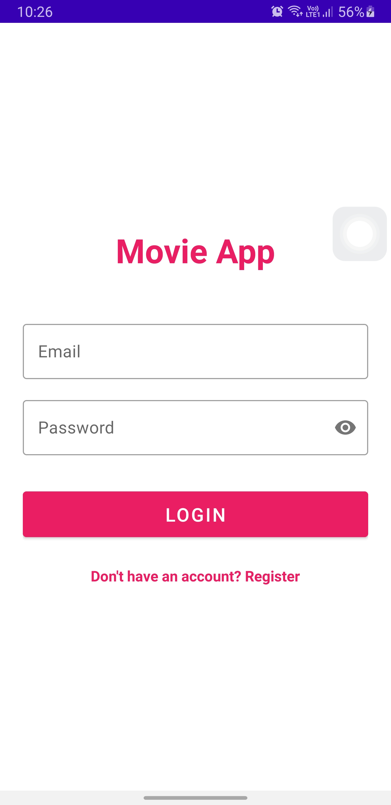
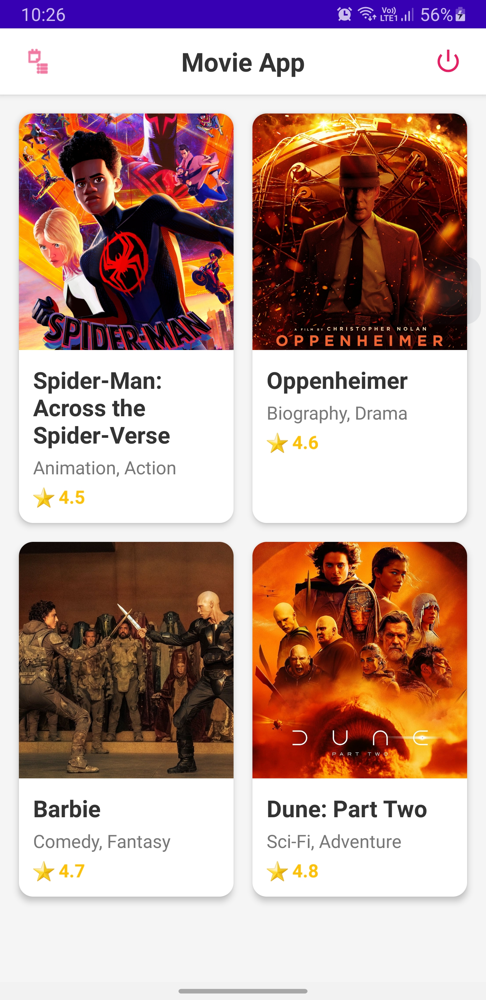
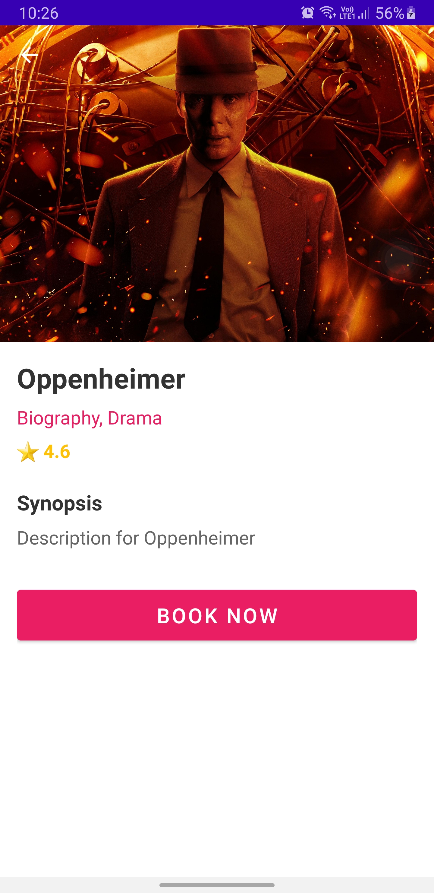
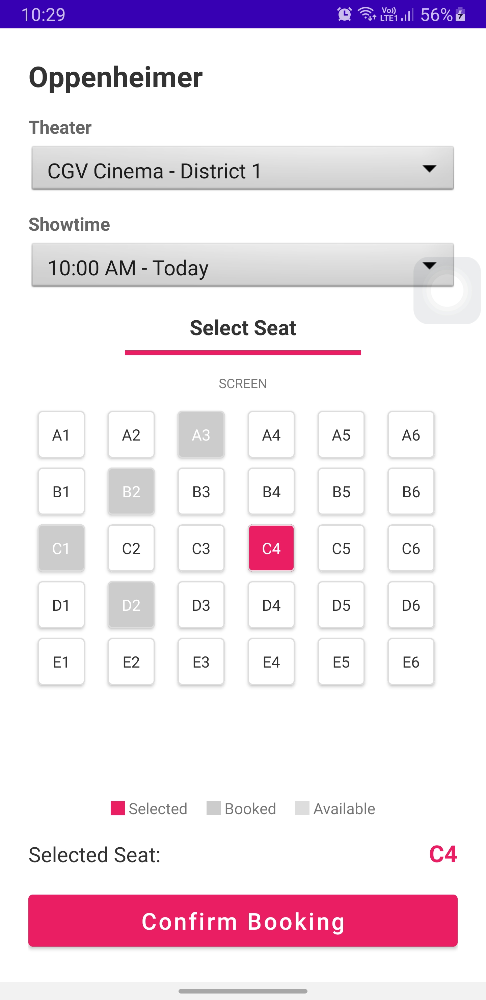
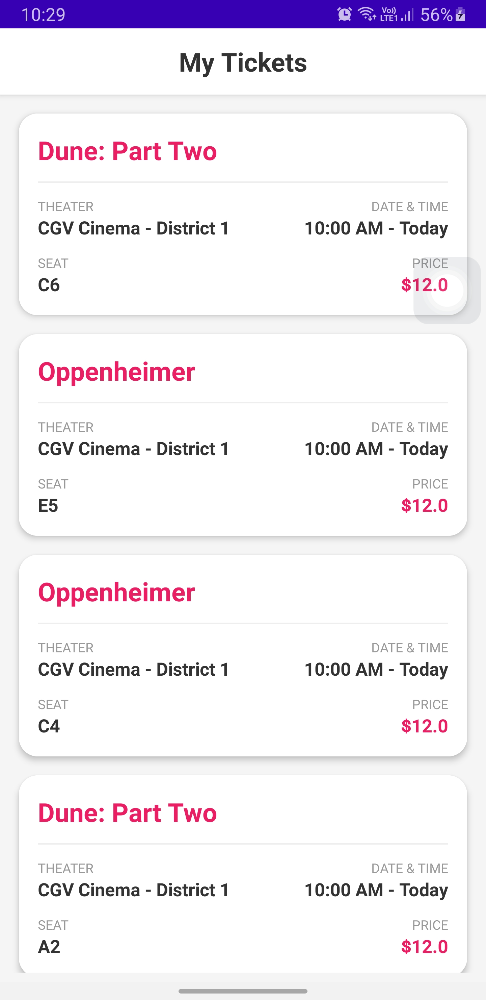
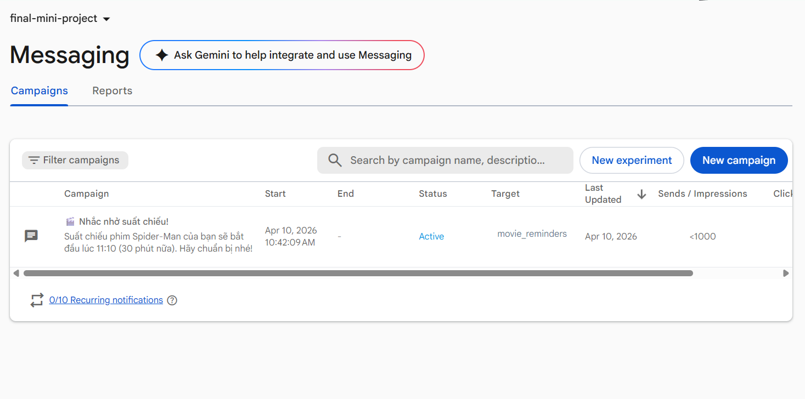
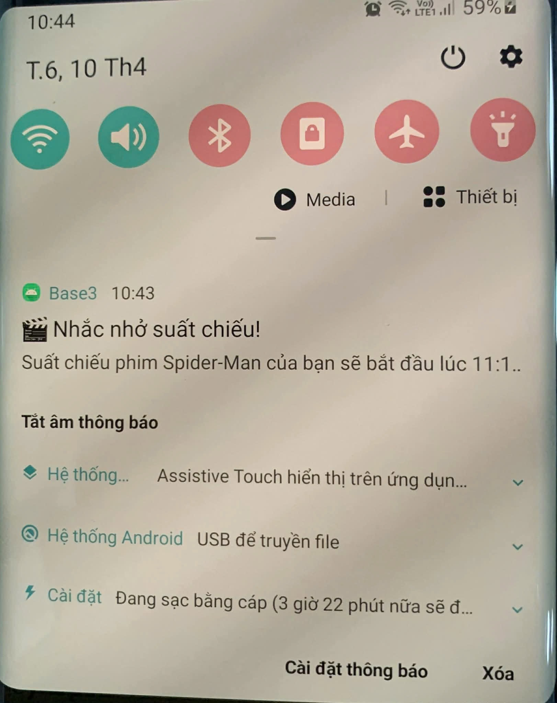
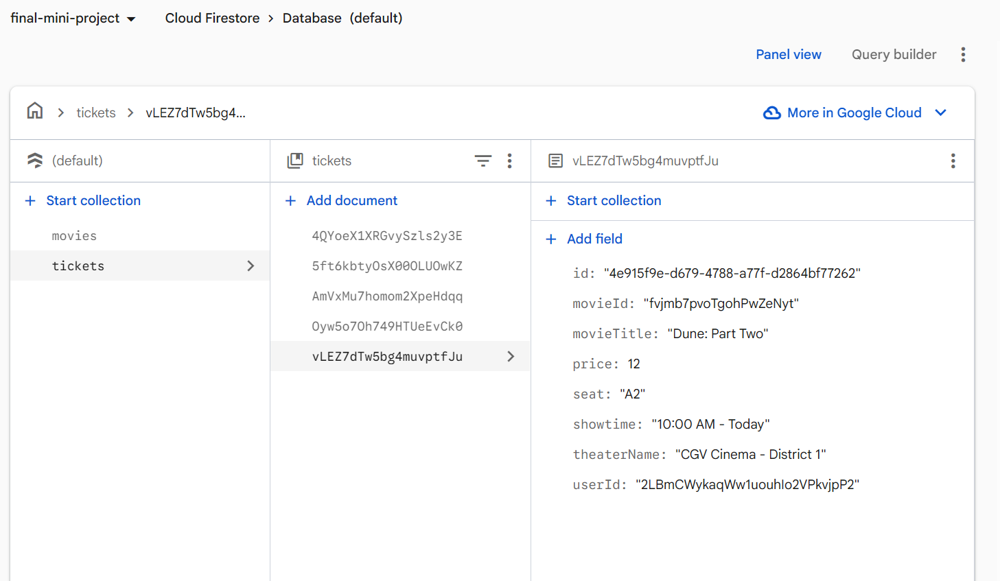

# Movie Ticket Booking App 🎬

Ứng dụng đặt vé xem phim hiện đại tích hợp Firebase, được thiết kế với giao diện Material Design sang trọng và đầy đủ chức năng.

## 🚀 Tính năng nổi bật

- **Đăng nhập Firebase Auth:** Bảo mật, nhanh chóng.
- **Danh sách phim (Home):** Hiển thị danh sách phim đang chiếu với hình ảnh chất lượng cao.
- **Chi tiết phim:** Xem nội dung, đánh giá và thể loại phim với hiệu ứng cuộn mượt mà.
- **Đặt vé thông minh (Booking):** 
  - Chọn rạp và suất chiếu linh hoạt.
  - Giao diện chọn vị trí ghế (Seat Map) trực quan.
  - Tính tổng tiền tự động.
- **Quản lý vé:** Lưu trữ và xem lại danh sách vé đã đặt trên Cloud.
- **Thông báo đẩy (FCM):** Nhận thông báo nhắc nhở khi sắp đến giờ chiếu phim.

## 📸 Hình ảnh minh họa

| Màn hình Đăng nhập | Danh sách Phim |
|:---:|:---:|
|  |  |

| Chi tiết Phim | Đặt vé & Chọn ghế |
|:---:|:---:|
|  |  |

| Danh sách Vé đã đặt |
|:---:|
|  |

## 🔔 Firebase Cloud Messaging (FCM)

Hệ thống thông báo đẩy giúp nhắc nhở người dùng về suất chiếu sắp tới.

| Thiết lập Campaign trên Console | Thông báo hiển thị trên thiết bị |
|:---:|:---:|
|  |  |

## 🗄️ Cấu trúc Dữ liệu Firebase (Cloud Firestore)

Dữ liệu phim, rạp và vé được quản lý tập trung trên Firebase Firestore.

| Quản lý Data trên Firestore Console |
|:---:|
|  |

## 🛠 Công nghệ sử dụng

- **Ngôn ngữ:** Java / Android SDK
- **Backend:** Firebase (Authentication, Firestore, Cloud Messaging)
- **Thư viện UI/UX:** Material Design Components, Glide (Image loading), ViewBinding.
- **Kiến trúc:** Clean Architecture với mô hình Model-View-Adapter.

## ⚙️ Cài đặt

1. Clone dự án về Android Studio.
2. Thêm file `google-services.json` vào thư mục `app/`.
3. Bật **Email/Password Auth** và **Firestore** trên Firebase Console.
4. Chạy ứng dụng và trải nghiệm.

---
*Phát triển bởi Đinh Quang Hưng - B22DCCN407* 🍿